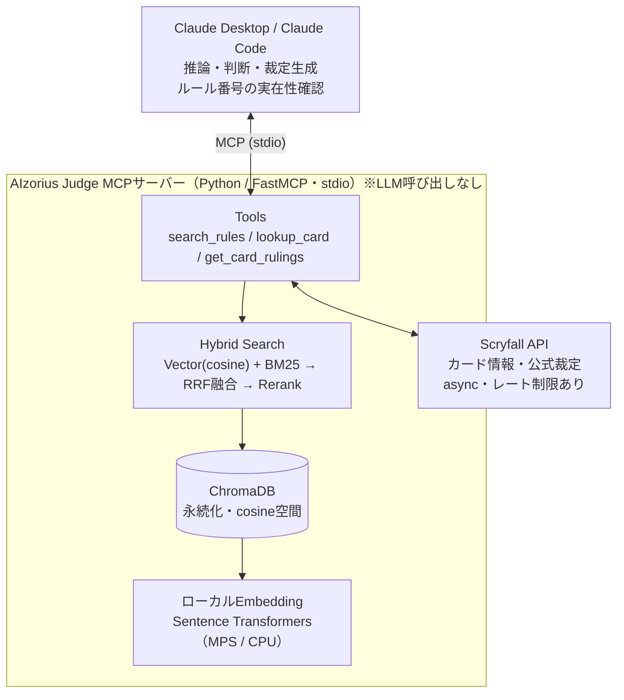
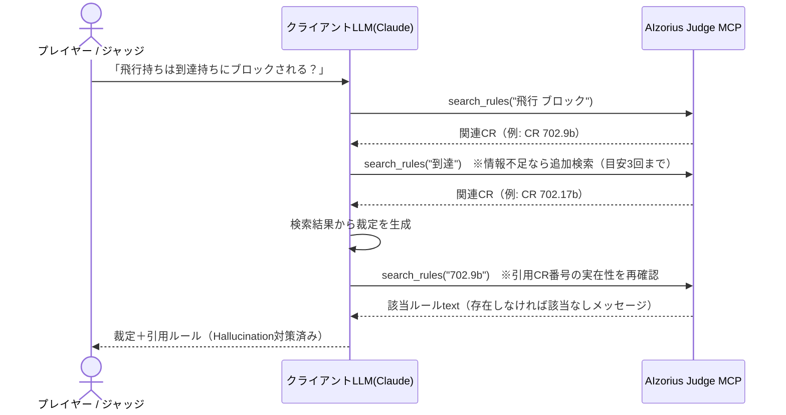

# Architecture（構成、ツール契約、検索・データパイプライン）

システム設計の正本。図は目的別の標準図種で分ける（静的構造はコンテナ図、時系列はシーケンス図）。

> **設計の一言まとめ**：MCPサーバーは「情報検索の道具箱」に徹し、考える（推論・裁定生成）のはクライアント側のLLM。すべてローカル・無料で完結させる。

## 0. 確定した設計判断

| # | 判断 | 理由 |
|---|------|------|
| 1 | **MCPサーバー内でLLMを使わない** | 推論はクライアント（Claude Desktop / Claude Code）が担当。運用コスト$0 |
| 2 | **Embeddingはローカル実行**（Sentence Transformers） | OpenAI API不要。Apple SiliconのMetal(MPS)で高速・無料・オフライン可 |
| 3 | **ツールは3つに限定** | `search_rules` / `lookup_card` / `get_card_rulings`。責務を検索に絞る |
| 4 | **評価はClaude Code中心** | 開発環境に統合。追加コストなしで品質測定。外部LLM評価はオプション |
| 5 | **データ更新は差分のみ・LLM不使用** | 文字列比較で差分検出。再インデックスは変更分だけ |

## 1. 全体構成（コンテナ図）
何がどう繋がっているか（静的構造）。実行順序はここに描かず、次のシーケンス図で示す。



## 2. 実行フロー（シーケンス図）
1回の裁定の時系列（例：「飛行持ちは到達持ちにブロックされる？」）。**裁定の生成と引用CR番号の再検証はクライアントが行う。**



## 3. MCPツール契約（API）
公開するツールは3つのみ。すべて**検索結果を返すだけ**で、要約・裁定生成はしない。I/O は Pydantic で型定義する（→ [.claude/rules/coding.md](../.claude/rules/coding.md)）。

| ツール | 引数 | 返り値 | 備考 |
|--------|------|--------|------|
| `search_rules` | `query: str`, `max_results: int = 5`, `section: str?` | 整形済みルールtext | ルール番号直接指定も可（例 `"702.9b"`）。`section` で絞り込み |
| `lookup_card` | `card_name: str` | カード情報text | Scryfall fuzzy検索（`/cards/named`）。日英対応 |
| `get_card_rulings` | `card_name: str` | 公式裁定リストtext | Scryfall `rulings_uri` から取得 |

- 該当なしは**エラーではなく分かりやすいメッセージ**を返す（クライアントLLMが次の行動を判断できるように）。
- Scryfall はレート制限を守る：リクエスト間に 50–100ms sleep、User-Agent 付与、`httpx` で async 呼び出し。

## 4. 検索パイプライン（Hybrid Search・Phase 1 で計測確定）
- **Vector検索**（cosine）＋ **BM25**（キーワード一致）→ **RRF融合（k=60）** → **多言語 Cross-Encoder rerank**（上位50件）。
- **Vectorは言語別インデックス（決定）**：1ルールにつき英語・日本語で別々のベクトルを持ち（`number#en` / `number#ja`）、検索時にルール番号で重複排除する。日英併記1本より recall@5 が+0.02、日本語単体と同等で英語クエリにも強い。
- **BM25 は日英併記テキスト**に対して、形態素解析器なしのトークナイザ（英数字は単語・ルール番号は1トークン・日本語は文字バイグラム）で構築。
- **Reranker：`BAAI/bge-reranker-v2-m3`（多言語・決定）**。設計原案候補の `ms-marco-MiniLM-L-6-v2`（英語学習）は多言語要件に合わず不採用。軽量多言語（mmarco-mMiniLMv2）も品質劣化が大きく不採用。`RERANKER_MODEL` を空にすると rerank なしの高速構成になる。
- Embedding モデル：**`intfloat/multilingual-e5-base`（決定）**。E5系の接頭辞（`query: ` / `passage: `）を付与。Phase 0 の bake-off（[../evaluation/reports/spike-embedding.md](../evaluation/reports/spike-embedding.md)）で `paraphrase-multilingual-MiniLM-L12-v2`（recall@5 0.20）に対し明確に優位。デバイスは `mps`（Apple Silicon）、フォールバック `cpu`。
- **実測性能と構成の使い分け**（M4/MPS・110問・[../evaluation/reports/retrieval-tuning.md](../evaluation/reports/retrieval-tuning.md)）：

  | 構成 | recall@5 | must_cite recall@5 | MRR | p50 / p95 |
  |---|---|---|---|---|
  | 既定（rerank あり） | 0.519 | **0.805** | 0.753 | 4.6s / 9.1s |
  | 高速（rerank なし） | 0.429 | 0.636 | 0.607 | 29ms / 50ms |

  品質とレイテンシは強いトレードオフ（poolや入力長を削るとどの案も品質が大きく崩れる）で、裁定支援ではLLMクライアントのツール呼び出しに数秒が許容されるため**品質優先を既定**とする。レイテンシ短縮（ONNX化・蒸留reranker等）は Phase 2 以降の課題。

## 5. データソースとパイプライン

### データソース
| データ | ソース |
|---|---|
| 総合ルール（CR） | Wizards公式（英語CR・TXT）＋ mtg-jp.com（日本語CR・HTML） |
| カード情報・公式裁定 | Scryfall API（認証不要） |
| リリースノート / CR更新 | Wizards公式 |

### CR原文の取り扱い（利用条件・版固定）
- **CR本文・パース済みJSONはリポジトリにコミットしない**（`data/raw/`・`data/comprehensive_rules*.json` は gitignore）。Wizards Fan Content Policy は IP の逐語コピー再配布を許可しておらず、公開リポジトリへの同梱は安全側で回避する。取得は `scripts/fetch_rules.sh` でローカルに再現する。
- ファンコンテンツとしての公開時は Fan Content Policy の条件（無償・非公式の明記等）に従う。**最終判断は人間**（ポリシー原文：https://company.wizards.com/en/legal/fancontentpolicy ）。
- **版固定**：取得したCRのURL・発効日・SHA-256 を `data/MANIFEST.json`（メタデータのみ・コミット可）に記録する。
- **英語CRが正文（authoritative）**。dataset の出典検証は英語CRの版に対して行う。日本語CR（和訳）は英語版に遅れて改訂されるため（版ズレが常態）、日本語CRは検索インデックス・日本語表示用と位置づけ、MANIFEST で両者の版を管理する。

### インデックス構築（初回 / モデル変更時）
1. CR（PDF/TXT）を `scripts/parse_rules.py` でJSON化（`{number, text, section, category}` の配列）
2. `data_loader.py` が ChromaDB へ投入（Embedding は自動計算＝ローカル）
3. 同時に BM25 インデックスを構築
4. ファイルハッシュ＋使用モデル名を collection metadata に記録（再構築判定に使用）

### 差分更新（Phase 4・LLM不使用）
- 新CRを取得しハッシュ比較 → 変わっていれば**文字列比較で差分計算**。
- `modified` は delete＋re-add、`added` は add、`removed` はアーカイブ。BM25 は再構築。

## 6. 品質・安全設計
- **Hallucination対策**：クライアントが引用CR番号を `search_rules` で再検証。存在しなければ警告を付与する。
- **反復検索**：情報不足なら追加で `search_rules` を呼ぶ（回数はクライアント判断、目安3回まで）。
- **Commander優先**：統率者戦ルール（税、統率者ダメージ、色アイデンティティ等）を評価データに厚めに含める（→ [EVALUATION.md](EVALUATION.md)）。
- **日本語対応**：多言語Embedding＋Scryfallの日本語カード名fuzzy。

## 7. 技術スタック・環境

### コア
- **MCP Framework**: FastMCP 0.13+（stdio transport）
- **Vector DB**: ChromaDB 0.5+（永続化、cosine空間）
- **Embedding**: Sentence Transformers（ローカル・OpenAI不使用）
- **依存**: fastmcp, chromadb, sentence-transformers, torch, rank-bm25, httpx, pypdf（**anthropic / openai は入れない**。評価用 openai は `optional-dependencies` の `eval` のみ）

### 環境
- 開発機：MacBook Pro M4 / 32GB / macOS 15.x（MPS加速）
- Python 3.12（uv 管理 → [.claude/rules/python.md](../.claude/rules/python.md)）
- APIキー不要。環境変数はすべて任意（デフォルトで動く）：`EMBEDDING_MODEL` / `EMBEDDING_DEVICE`（mps|cpu）/ `DATA_DIR`

## 8. ディレクトリ構造

```
aizorius-judge/
├── CLAUDE.md                    # プロジェクト方針（要約とポインタ）
├── README.md
├── pyproject.toml               # 依存・ツール設定を集約
├── .env.example
├── .claude/rules/               # 詳細ルール（自動ロード）
├── docs/                        # 設計ドキュメント（本書ほか）
├── src/aizorius_judge/
│   ├── server.py                # FastMCP本体 + lifespan（起動時インデックスロード）
│   ├── settings.py              # 設定（pydantic-settings。APIキー不要）
│   ├── models.py                # 型定義の集約（Pydantic / dataclass / Enum）
│   ├── rules_parser.py          # CR原文のパース（scripts/parse_rules.py から利用）
│   ├── data_loader.py           # CR JSONロード + ChromaDBインデックス + BM25構築
│   ├── search.py                # HybridSearcher（Vector+BM25+RRF+Rerank）
│   ├── rules_updater.py         # 差分検出・段階的更新（LLM不使用）
│   ├── tools/
│   │   ├── search_rules.py
│   │   ├── lookup_card.py
│   │   └── get_rulings.py
│   └── cli/update_rules.py      # 手動更新CLI
├── data/
│   ├── MANIFEST.json            # CR版固定メタデータ（コミット対象）
│   ├── raw/                     # CR原文（.gitignore）
│   ├── chromadb/                # 永続化（.gitignore）
│   └── comprehensive_rules_{en,ja}.json # パース済みCR（.gitignore）
├── evaluation/                  # 評価（→ EVALUATION.md）
│   ├── dataset.jsonl
│   ├── test_runner.md
│   └── reports/
├── tests/
│   ├── test_mcp_tools.py
│   └── test_search.py
└── scripts/
    ├── parse_rules.py           # CR PDF/TXT → JSON
    ├── check_updates.sh         # cron用
    └── run_external_eval.py     # 外部評価（オプション）
```

**命名**：パッケージ `aizorius-judge` / import `aizorius_judge` / MCP表示名 `AIzorius Judge`。
**レイアウト**：`src/<パッケージ名>/` の src layout（PyPA / uv `--package` / MCP公式リファレンスサーバーと同じ形。根拠は [.claude/rules/python.md](../.claude/rules/python.md) §0）。`[project.scripts]` でエントリポイントを定義し、Claude Desktop へは `uv run aizorius-judge`（または `python -m aizorius_judge`）で登録する。
