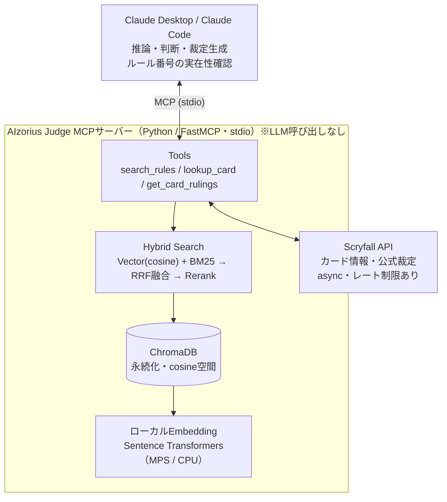
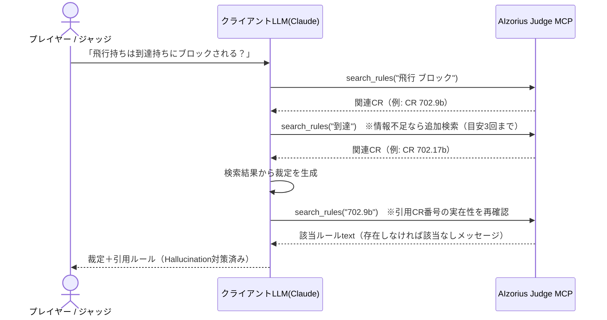

# Architecture（構成、ツール契約、検索・データパイプライン）

システム設計の正本。図は目的別の標準図種で分ける（静的構造はコンテナ図、時系列はシーケンス図）。

> **設計の一言まとめ**：MCPサーバーは「情報検索の道具箱」に徹し、考える（推論・裁定生成）のはクライアント側のLLM。すべてローカル・無料で完結させる。

## 0. 確定した設計判断

| # | 判断 | 理由 |
|---|------|------|
| 1 | **MCPサーバー内でLLMを使わない** | 推論はクライアント（Claude Desktop / Claude Code）が担当。運用コスト$0 |
| 2 | **Embeddingはローカル実行**（Sentence Transformers） | OpenAI API不要。Apple SiliconのMetal(MPS)で高速・無料・オフライン可 |
| 3 | **ツールは3つに限定** | `search_rules` / `lookup_card` / `get_card_rulings`。責務を検索に絞る |
| 4 | **評価はClaude Code中心** | 開発環境に統合。追加コストなしで品質測定。外部LLM評価はオプション |
| 5 | **データ更新は差分のみ・LLM不使用** | 文字列比較で差分検出。再インデックスは変更分だけ |

## 1. 全体構成（コンテナ図）
何がどう繋がっているか（静的構造）。実行順序はここに描かず、次のシーケンス図で示す。



## 2. 実行フロー（シーケンス図）
1回の裁定の時系列（例：「飛行持ちは到達持ちにブロックされる？」）。**裁定の生成と引用CR番号の再検証はクライアントが行う。**



## 3. MCPツール契約（API）
公開するツールは3つのみ。すべて**検索結果を返すだけ**で、要約・裁定生成はしない。I/O は Pydantic で型定義する（→ [.claude/rules/coding.md](../.claude/rules/coding.md)）。

| ツール | 引数 | 返り値 | 備考 |
|--------|------|--------|------|
| `search_rules` | `query: str`, `max_results: int = 7`, `section: str?` | 整形済みルールtext（**親ルール単位のグループ**。`max_results` はグループ数） | ルール番号直接指定も可（例 `"702.9b"`）。`section` で絞り込み。既定7はグループ数感度の実測（§4）に基づく |
| `lookup_card` | `card_name: str` | カード情報text | Scryfall fuzzy検索（`/cards/named`）。日英対応 |
| `get_card_rulings` | `card_name: str` | 公式裁定リストtext | Scryfall `rulings_uri` から取得 |

- 該当なしは**エラーではなく分かりやすいメッセージ**を返す（クライアントLLMが次の行動を判断できるように）。
- Scryfall はレート制限を守る：リクエスト間に 50–100ms sleep、User-Agent 付与、`httpx` で async 呼び出し。

## 4. 検索パイプライン（Hybrid Search・計測で確定）
`Vector（言語別）＋ BM25 ＋ 用語集照合 → RRF融合（k=60）→ 多言語rerank → 親ルールでグループ化して返却`

- **Vectorは言語別インデックス（決定）**：1ルールにつき英語・日本語で別々のベクトルを持ち（`number#en` / `number#ja`）、検索時にルール番号で重複排除する。
- **BM25 は日英併記テキスト**に対して、形態素解析器なしのトークナイザ（英数字は単語・ルール番号は1トークン・日本語は文字バイグラム）で構築。
- **第3系統＝用語集照合（決定）**：CR用語集（約800語・日英対応）をパースし、クエリ中のMTG用語（「威迫」「統率者税」等）を定義ルール番号へ決定論的に対応付ける（`data/glossary.json`。LLM不使用）。キーワード的なクエリに対する精度の柱。定義文の参照抽出は複数形・レター範囲・列挙（"rules 509.1b–c" 等）に対応。用語の**セクション参照**（例 統率者→rule 903）は弱重み（0.3）の補助系統として章の親ルールへ展開する——小さな章（親≤8）は全親、大きな章は**先頭8親**（章の定義・動作原理が並ぶ。全スキップ比で recall@7 +0.006 / must_cite@7 +0.010・劣化なしの実測で採用。なお「用語集明示ヒットの最終グループ枠保証」案は汎用語が枠を占有して recall 微減・効果ゼロの実測により**棄却**）。
- **照合・トークン化は NFKC 正規化**：全角半角ゆれ（"７０２．９ｂ"・全角英字）を tokenize・用語集照合・ルール番号直接引きの全てで吸収する。番号直接引きは境界を厳密判定（"702.9" に 702.90〜99 を混入させない）し、数値順で返す。
- **返却単位＝親ルールのグループ（決定）**：ヒットしたサブルール単体でなく、親ルール＋全サブルール（例: 702.11 呪禁の a〜d）を1グループとして返す。正解ルールは兄弟クラスタで現れることが多く（エラー分析）、ジャッジの実務とも一致する。`max_results`＝グループ数。
- **Reranker：`BAAI/bge-reranker-v2-m3`（多言語・決定）**。設計原案候補の `ms-marco-MiniLM-L-6-v2`（英語学習）は多言語要件に合わず不採用。`RERANKER_MODEL` を空にすると rerank なしの高速構成になる。
- Embedding モデル：**`intfloat/multilingual-e5-base`（決定）**。E5系の接頭辞（`query: ` / `passage: `）を付与。初期スパイクの bake-off（[../evaluation/reports/spike-embedding.md](../evaluation/reports/spike-embedding.md)）で明確に優位。デバイスは `mps`（Apple Silicon）、フォールバック `cpu`。
- **実測性能と構成の使い分け**（M4/MPS・110問・[../evaluation/reports/retrieval-tuning.md](../evaluation/reports/retrieval-tuning.md)）：

  | 構成 | recall | must_cite recall | MRR |
  |---|---|---|---|
  | 既定（rerank あり）・単一クエリ・k=5 | 0.692 | 0.859 | 0.785 |
  | 既定・単一クエリ・k=7 | 0.752 | 0.905 | 0.789 |
  | 既定・実運用相当（実LLM言い換え込み反復・k=7） | **0.890** | **0.995** | — |
  | 高速（rerank なし）・単一クエリ・k=5 | 0.640 | 0.791 | 0.723 |

  既定は品質優先（rerankあり・p50 約5s）。高速構成（p50 約0.1s）は rerank なしでも旧設計の品質構成を上回っており、レイテンシ重視の環境では十分実用になる。反復検索（クライアントの追加クエリ）が must_cite を 0.995 まで引き上げるため、ツール説明でクライアントに反復検索を促す（§6）。実運用相当の測定に使う言い換えクエリの生成規約（golden 遮断）は [../evaluation/test_runner.md](../evaluation/test_runner.md)。
- **返却グループ数の既定は7**：グループ数感度の実測は k=5: 0.692/0.859 → k=7: **0.752/0.905**（単一クエリ・recall/must_cite）で、k=8 はほぼ頭打ち。k=7 でコンテキスト量と回収率のバランスがよい。

## 5. データソースとパイプライン

### データソース
| データ | ソース |
|---|---|
| 総合ルール（CR） | Wizards公式（英語CR・TXT）＋ mtg-jp.com（日本語CR・HTML） |
| カード情報・公式裁定 | Scryfall API（認証不要） |
| リリースノート / CR更新 | Wizards公式 |

### CR原文の取り扱い（利用条件・版固定）
- **CR本文・パース済みJSONはリポジトリにコミットしない**（`data/raw/`・`data/comprehensive_rules*.json` は gitignore）。Wizards Fan Content Policy は IP の逐語コピー再配布を許可しておらず、公開リポジトリへの同梱は安全側で回避する。取得は `scripts/fetch_rules.sh` でローカルに再現する。
- ファンコンテンツとしての公開時は Fan Content Policy の条件（無償・非公式の明記等）に従う。**最終判断は人間**（ポリシー原文：https://company.wizards.com/en/legal/fancontentpolicy ）。
- **版固定**：取得したCRのURL・発効日・SHA-256 を `data/MANIFEST.json`（メタデータのみ・コミット可）に記録する。
- **英語CRが正文（authoritative）**。dataset の出典検証は英語CRの版に対して行う。日本語CR（和訳）は英語版に遅れて改訂されるため（版ズレが常態）、日本語CRは検索インデックス・日本語表示用と位置づけ、MANIFEST で両者の版を管理する。

### プロジェクトのライセンスと外部データの取り込み基準（2026-07-04 決定）
- 本リポジトリ（コード・ドキュメント・評価データセット）は **MIT License**（単一 LICENSE）。README に Fan Content Policy の定型文言を掲示する。
- 外部Q&Aデータの取り込みは**利用条件を一次情報で確認してから**（推測で進めない）。判定基準:
  - **CC0 / CC BY（帰属のみ）→ 優先して取り込み可**。`source` に出典・ライセンスを明記し、必要な帰属表示を README または NOTICE に記載する。
  - **CC BY-SA / GPL系（継承つき）→ 本体（dataset.jsonl）に混ぜない**。使う場合は別ファイル（例 `dataset-external.jsonl`）＋個別ライセンス表記に隔離し、本体の MIT を維持する。
  - **CC BY-NC 等の非商用限定 → 取り込まない**（OSS配布と衝突）。
  - ライセンスとは別に**利用規約の制約**（例: RulesGuru の「ML利用は要許諾」）はライセンス互換でも許諾取得が必要。
- 取り込み時の品質運用は評価データセットの既存規約のまま（逐語コピーなし・言い換え＋CR照合・人間承認 → [EVALUATION.md](EVALUATION.md) §3）。

外部Q&Aソースの一次調査結果（2026-07-04。**CC0/CC BY の MTGルールQ&Aは現存しない**）:

| ソース | 条件（一次確認済み） | 判定 |
|---|---|---|
| RulesGuru（rulesguru.org・約1,500問・人手検証） | 非商用＋帰属で利用可だが「**ML模型の開発への利用は明示許諾が必要**」（About原文）。許諾は撤回権付き | **要許諾**（連絡先 is.aack@yahoo.com）。許諾を得ても非商用・撤回権付きのため**MITリポジトリへの同梱は不可**＝ローカル取得・非再配布（CRと同方式）が前提 |
| boardgames.stackexchange.com（MTGタグ） | 投稿は CC BY-SA 4.0（投稿URL＋著者プロフィールへのリンク帰属が必須）。**公式ダンプは2024年以降「LLM訓練に使わない」同意付き** | **隔離すれば可**（本体に混ぜず別ファイル or ローカル限定）。一括ダンプでなく対象タグの個別取得が無難。ライセンス版の切替日ページは未確認（取り込み前に人手確認） |
| Hugging Face 上のMTG QAデータセット（MTG-Eval 80k ほか5件） | 全件**ライセンス宣言なし**または無ライセンス上流のマージ。多くはGPT合成で正解保証もない | **不可** |
| Cranial Insertion（判事執筆の週刊Q&A） | 再利用許諾条項なし＝全権利留保 | **要許諾**（moko@cranial-insertion.com） |

### インデックス構築（初回 / モデル変更時）
1. CR（PDF/TXT）を `scripts/parse_rules.py` でJSON化（`{number, text, section, category}` の配列）
2. `data_loader.py` が ChromaDB へ投入（Embedding は自動計算＝ローカル）
3. 同時に BM25 インデックスを構築
4. ファイルハッシュ＋使用モデル名を collection metadata に記録（再構築判定に使用）

### 差分更新（自動更新フェーズ・LLM不使用 → [PLAN.md](PLAN.md)）
- 新CRを取得しハッシュ比較 → 変わっていれば**文字列比較で差分計算**。
- `modified` は delete＋re-add、`added` は add、`removed` はアーカイブ。BM25 は再構築。

## 6. 品質・安全設計
- **Hallucination対策**：クライアントが引用CR番号を `search_rules` で再検証。存在しなければ警告を付与する。
- **反復検索**：情報不足なら角度を変えたクエリで追加の `search_rules` を呼ぶ。回数の上限は設けず、**十分性基準**で止める（結論と引用ルールが検索結果で裏付けられた時点で終了）。単発クエリの検索は正解ルールの一部を取り逃すことがあり（検索単体評価の実測）、反復検索がその回収経路になる。サーバーは回数を制限しない。
- **Commander優先**：統率者戦ルール（税、統率者ダメージ、色アイデンティティ等）を評価データに厚めに含める（→ [EVALUATION.md](EVALUATION.md)）。
- **日本語対応**：多言語Embedding＋Scryfallの日本語カード名fuzzy。

## 7. 技術スタック・環境

### コア
- **MCP Framework**: FastMCP 0.13+（stdio transport）
- **Vector DB**: ChromaDB 0.5+（永続化、cosine空間）
- **Embedding**: Sentence Transformers（ローカル・OpenAI不使用）
- **依存**: fastmcp, chromadb, sentence-transformers, torch, rank-bm25, httpx, pypdf（**anthropic / openai は入れない**。評価用 openai は `optional-dependencies` の `eval` のみ）

### 環境
- 開発機：MacBook Pro M4 / 32GB / macOS 15.x（MPS加速）
- Python 3.12（uv 管理 → [.claude/rules/python.md](../.claude/rules/python.md)）
- APIキー不要。環境変数はすべて任意（デフォルトで動く）：`EMBEDDING_MODEL` / `EMBEDDING_DEVICE`（mps|cpu）/ `DATA_DIR`

## 8. ディレクトリ構造

```
aizorius-judge/
├── CLAUDE.md                    # プロジェクト方針（要約とポインタ）
├── README.md
├── pyproject.toml               # 依存・ツール設定を集約
├── .env.example
├── .claude/rules/               # 詳細ルール（自動ロード）
├── docs/                        # 設計ドキュメント（本書ほか）
├── src/aizorius_judge/
│   ├── server.py                # FastMCP本体 + lifespan（起動時インデックスロード）
│   ├── settings.py              # 設定（pydantic-settings。APIキー不要）
│   ├── models.py                # 型定義の集約（Pydantic / dataclass / Enum）
│   ├── rules_parser.py          # CR原文のパース（scripts/parse_rules.py から利用）
│   ├── data_loader.py           # CR JSONロード + ChromaDBインデックス + BM25構築
│   ├── search.py                # HybridSearcher（Vector+BM25+RRF+Rerank）
│   ├── rules_updater.py         # 差分検出・段階的更新（LLM不使用）
│   ├── tools/
│   │   ├── search_rules.py
│   │   ├── lookup_card.py
│   │   └── get_rulings.py
│   └── cli/update_rules.py      # 手動更新CLI
├── data/
│   ├── MANIFEST.json            # CR版固定メタデータ（コミット対象）
│   ├── raw/                     # CR原文（.gitignore）
│   ├── chromadb/                # 永続化（.gitignore）
│   └── comprehensive_rules_{en,ja}.json # パース済みCR（.gitignore）
├── evaluation/                  # 評価（→ EVALUATION.md）
│   ├── dataset.jsonl
│   ├── test_runner.md
│   └── reports/
├── tests/
│   ├── test_mcp_tools.py
│   └── test_search.py
└── scripts/
    ├── parse_rules.py           # CR PDF/TXT → JSON
    ├── check_updates.sh         # cron用
    └── run_external_eval.py     # 外部評価（オプション）
```

**命名**：パッケージ `aizorius-judge` / import `aizorius_judge` / MCP表示名 `AIzorius Judge`。
**レイアウト**：`src/<パッケージ名>/` の src layout（PyPA / uv `--package` / MCP公式リファレンスサーバーと同じ形。根拠は [.claude/rules/python.md](../.claude/rules/python.md) §0）。`[project.scripts]` でエントリポイントを定義し、Claude Desktop へは `uv run aizorius-judge`（または `python -m aizorius_judge`）で登録する。
